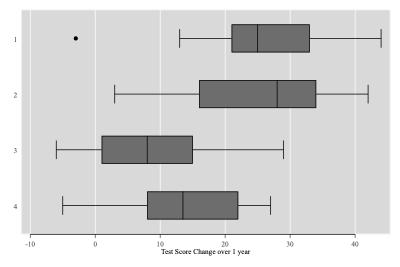

MarkDoc Mini
============

It is just a tradition to begin with __Hello__ _World_!

This is a new text paragraph. I can also use asterisk instead of 
underscore to make the text **bold** or *italic*, but the latter
is not supported in Stata help files (supported in html,docx,pdf). 

You can separate  your document by adding a horizontal line,
which is shown below. The alternative syntax mentioned in 
are also covered:

- - -

How about line-breaks without adding a new paragraph? 
In Markdown you can do a line break  
by adding 2 or more spaces   
at the end of the line  
to indicate a line-break     
without creating a new paragraph! This means you should pay a 
careful attention to the spaces you put in the documentation. 
They are very meaningful in Markdown syntax!

Hyperlinks
----------

Visit the [Markdown's developer site](https://daringfireball.net/projects/markdown/dingus) 
to make yourself familiar with the Markdown syntax. Unfortunately, 
Stata's __putdocx__ and __putpdf__ do not yet support 
hyperlinks, but the Stata help files generated by MarkDoc 
can show hyperlinks. 

Adding Indention
----------------

You can also indent your text as well as do nested indention. 
Use the ">" sign at the beginning of the line to indent it.

> this is a Markdown indention

> > this is indention level 2

> > > this is indention level 3

Code lines and code blocks
--------------------------

Code is shown in monospace font in the documents. Usually it 
is also styled to make it distinct from the text paragraphs. 
If you wish to add a line of code, begin the line with 4:

    This is a code! Please **DO NOT** *INTERPRET* Markdown code
    This is another code line

If you have a code block of several lines, it is easier to 
place it in a code block as shown below. You don't have to 
indent the code block with 4 spaces, it's all done 
automatically. and of course, you can put a single line of 
code in it as well!

~~~
This is a code block! Please **DO NOT** *INTERPRET* Markdown code
This is another code line
~~~

There is no limit on how many paragraphs you can write. Just 
keep an empty line between paragraphs or the previous styled
text (header, code block, indented code, horizontal lines, etc.

Adding a list
-------------

making a list is easy. Just begin a line with a number, immediately 
followed by a dot. or a dash followed by a space. 

Stata's __putdocx__ and __putpdf__ do not support lists yet. 
I created a workaround to support Markdown lists 
But nested lists are not yet implemented because they look 
rather ugly without a decent support of lists in the document... 

1. This is a list
2. This is list 2
3. This is list 3

- This is unordered list
- This is also unordered list

Limitations
===========

Some of the Markdown syntax is __NOT__ yet supported by Stata's __putdocx__ or 
__putpdf__ commands. These limitations are:

1. Hyperlink 
2. Nested lists
3. Mathematical notations

Markdown Tables
===============

> __NOTE__: Markdown tables are not supported in Stata Help files

Markdown also supports tables! Currently 2 table flavors are 
recognized, but you can cooperate to increase the supported 
tables!

### The recommended format

This is the recommended format, that is also used by the 
__tbl__ command for generating dynamic tables (see below)

"Column1"|"Column2"|"Column3"     
:--------|:--------:|:--------:   
Cat|Soccer|Apple 
Dog|Basketball|Orange 
Ape|baseball|Banana 

You can also style a cell:

"Column1"|"Column2"|"Column3"     
:--------|:--------:|:--------:   
__Cat__|Soccer|Apple 
__Dog__|Basketball|Orange 
__Ape__|baseball|Banana 

### The alternative format (not recommended)

The alternative format requires more work to create and 
adjust. You don't really want to do it manually... 

| __Animals__ | __Sports__ | __Fruits__ |
|-------------|------------|------------|
| Cat         | Soccer     | Apple      |
| Dog         | Basketball | Orange     |
| Ape         | baseball   | Banana     | 

Adding a figure with caption
----------------------------

Adding a figure with markdown is simple. if we __assume__ that 
you have an image file in your current working directory named 
__graph.png__, we can easily include it in the document 
using the following syntax:

Next, I will introduce you to other commands that can be used 
to generate dynamic tables and include figures.

> of course, Stata help files are unable of rendering image files

Adding a figure dynamically
===========================

          . clear

          . sysuse auto
          (1978 Automobile Data)

          . histogram price
          (bin=8, start=3291, width=1576.875)

Adding a dynamic table
===========================

          . sysuse auto, clear
          (1978 Automobile Data)

          . foreach var of varlist weight price mpg {
          .         summarize `var'
          .         local `var'_mean : display %9.2f r(mean)
          .         local `var'_sd   : display %9.2f r(sd)
          . }

              Variable |        Obs        Mean    Std. Dev.       Min        Max
          -------------+---------------------------------------------------------
                weight |         74    3019.459    777.1936       1760       4840

              Variable |        Obs        Mean    Std. Dev.       Min        Max
          -------------+---------------------------------------------------------
                 price |         74    6165.257    2949.496       3291      15906

              Variable |        Obs        Mean    Std. Dev.       Min        Max
          -------------+---------------------------------------------------------
                   mpg |         74     21.2973    5.785503         12         41

Table 1. Summary of __weight__, __price__, and __mpg__ variables

Variable Name|Mean|SD     
:--------|:--------:|:--------:   
__weight__|3019.46|777.19    
__price__|6165.26|2949.50    
__mpg__|21.30|5.79   

The tbl command is very powerful and it allows you to take 
full control of your table. For example, you can format the 
text you wish to show in the cells, using exactly the same syntax 
as the __display__ comand in Stata!

          . summarize price

              Variable |        Obs        Mean    Std. Dev.       Min        Max
          -------------+---------------------------------------------------------
                 price |         74    6165.257    2949.496       3291      15906

          . return list

          scalars:
                            r(N) =  74
                        r(sum_w) =  74
                         r(mean) =  6165.256756756757
                          r(Var) =  8699525.974268788
                           r(sd) =  2949.495884768919
                          r(min) =  3291
                          r(max) =  15906
                          r(sum) =  456229

Variable|Observations|Mean|SD     
:--------|:--------:|:--------:|:--------:   
__price__|74|6165.26|2949.50   

Dynamic text
===========================

There are two ways to write dynamic text in MarkDoc 
(and MarkDoc _mini_). The first is using the __txt__ command.
This is a powerful command that also allows styling the text. 
For example, I use the txt command to create a dynamic Markdown 
table below (not recommended, only for demonstration)

          . local l1 Cat

          . local l2 Dog

          . local l3 Soccer

          . local l4 Basketball

          . local l5 Apple 

          . local l6 Orange

           

| __Animals__ | __Sports__ | __Fruits__ |
|-------------|------------|------------|
| Cat        | Soccer       | Apple       |
| Dog        | Basketball       | Orange       |

I can use the __return list__ command to see what macros are returned by the 
`summarize` command. These values will be printed:

          . summarize price

              Variable |        Obs        Mean    Std. Dev.       Min        Max
          -------------+---------------------------------------------------------
                 price |         74    6165.257    2949.496       3291      15906

          . return list

          scalars:
                            r(N) =  74
                        r(sum_w) =  74
                         r(mean) =  6165.256756756757
                          r(Var) =  8699525.974268788
                           r(sd) =  2949.495884768919
                          r(min) =  3291
                          r(max) =  15906
                          r(sum) =  456229

           

the mean of Price variable is 6165.26

           

the minimum value is 3291 and the maximum is 15906

Alternative procedure for dynamic text
--------------------------------------

There is, however, a smarter way that can be used when you 
execute a do-file in Stata:

          . scalar a = 10.847958758976

          . matrix A = (1,2\ 3, 4)

          . scalar b = A[2,1]

          . local a = 999

          . sysuse auto, clear
          (1978 Automobile Data)

How about 10.847959?
-----------------

For example, we can show the value of the 10th observation 
of the __Price__ variable, which is 4082

You can also use this syntax to show a value of a 
macro 999 or Scalar 3, even when they are extracted 
from a matrix, e.g. 1 or 4!

