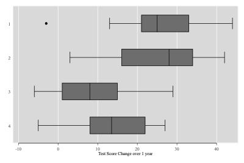



ANOVA I: One way analysis of variance
---

Today we'll cover the statistical method One way ANOVA (ANanlysis Of
VAriance), which looks at differences in the mean (average) between
groups, and tries to tell us if the different categories are
statistically different. *One way* means there is one independent
variable and one dependent variable. Note there can be multiple groups within 
a given variable e.g. income level could be low, middle or high.
    
You've already seen the T test being used for differences between
groups, so if the only difference is that there may be multiple groups, 
why not just perform multiple T tests? Well, if there are three categories, 
that means three tests. While the Type 1 error (false positive) rate is 5%, 
when we do three tests it becomes $$1-0.95^{3}=0.14$$ i.e. 14%. In other words, 
multiple T tests means we
become more likely to see a significant difference even when there isn't one. 
(This links to the *back to basics* lecture you'll see in week 11.)

test - $$1-0.95^{3}=0.14$$

//1-0.95^{3}=0.14//

NB: while we talk about T tests and ANOVA as though they are separate (they are!),
 there is some overlap. Specifically, if it is a one way
anova with only two groups, ANOVA becomes the same as a T test.
We can see that easily. Let's load some data 

          . webuse systolic
          (Systolic Blood Pressure Data)

          . oneway  systolic drug if drug>2 // This runs an anova with 2 groups 

                                  Analysis of Variance
              Source              SS         df      MS            F     Prob > F
          ------------------------------------------------------------------------
          Between groups      154.714286      1   154.714286      1.67     0.2076
           Within groups         2408.25     26       92.625
          ------------------------------------------------------------------------
              Total           2562.96429     27   94.9246032

          Bartlett's test for equal variances:  chi2(1) =   0.0636  Prob>chi2 = 0.801

          . ttest  systolic if drug>2, by(drug) // This runs an anova with 2 groups

          Two-sample t test with equal variances
          ------------------------------------------------------------------------------
             Group |     Obs        Mean    Std. Err.   Std. Dev.   [95% Conf. Interval]
          ---------+--------------------------------------------------------------------
                 3 |      12        8.75    2.892323     10.0193    2.384041    15.11596
                 4 |      16        13.5    2.330951    9.323805    8.531695     18.4683
          ---------+--------------------------------------------------------------------
          combined |      28    11.46429     1.84124    9.742926    7.686373     15.2422
          ---------+--------------------------------------------------------------------
              diff |               -4.75    3.675298               -12.30468    2.804682
          ------------------------------------------------------------------------------
              diff = mean(3) - mean(4)                                      t =  -1.2924
          Ho: diff = 0                                     degrees of freedom =       26

              Ha: diff < 0                 Ha: diff != 0                 Ha: diff > 0
           Pr(T < t) = 0.1038         Pr(|T| > |t|) = 0.2076          Pr(T > t) = 0.8962

Hypotheses and Strategy
=======================

Say we have our basic model: $Y_{ij}=\mu_{i}+\varepsilon_{ij}$, where
we're are interested in some continuous variable ($Y$) and whether it
varies by different groups (denoted by $_i$). The average of group $_i$ is 
given by $\mu_i$, and there is an error term (the unexplained bit) 
$\varepsilon_{ij}$ which varies both by groups $_i$ and individuals within 
those groups: $_{ij}$.

The Null hypothesis is (as always) essentially of no effect. So if we
have three groups ($i=1,2,3$), we can say our null is that all the
intercepts (i.e. the group means) are equal. Formally:
$H_O : \mu_1=\mu_2=\mu_3$.

Note that this doesn't tell us which group is different from the others. The
 typical strategy is simply to run an ANOVA to see if there are differences. 
 If there are, to also run some post-hoc comparisons (of
which we have many choices) to find where these differences are.

The basic rationale in ANOVA is about **the balance between the
variation within a group and the variation between groups**. To see
this, notice that the equation (below) is just one divided by the other, 
with a high number showing between group variation is more important and a 
low number showing within group variation is more important.

Questions: thinking through the logic
=====================================

One way of thinking about this F statistic is *how much is the
uncertainty about one individual's score reduced by knowing their
group*? Think of some extreme examples to help you get the logic behind
this. Would you expect a large or small F if:

1.  \... the groups are the degree classification (first, 2:1 etc), and
    the individual observations are the final degree average?

2.  \... the groups are the gender, and the observations are
    individual's height?

3.  \... the groups are the continents/regions, and the observations are country income?

4.  \... the groups are hair colour, and the observations are \# of gym
    visits per student per year?
    


For 1. I would expect a large F: the classification tells us a lot about degree average.  
For 2. I would expect a medium-large F. Women are, on average, shorter than men. That doesn't mean all women are short than all men - of course not! But knowing someone's gender would help us predict their height in a significant way. 
For 3. I'd expect a large F. The countries in Western Europe tend to be richer than those in Latin America, and then Sub-Saharan Africa. As above there is overlap, but knowing the group would help us predict.  
For 4. We'd expect a small F. Knowing the group wouldn't help us predict gym visits.    

 I've thought about these


How to calculate the ANOVA statistic
====================================

$$F=\dfrac{Between}{Within}=\dfrac{MS_{between}}{MS_{within}}=\dfrac{SS_{between}/df_{between}}{SS_{within}/df_{within}}$$

Where:

-   MS=Mean Square (either between groups or within groups)

-   SS=Sum of squares

-   $_i$ denotes groups and $_j$ individuals in groups

-   $SS_{between}=\sum_i N_i (\bar{x}_i-\bar{x})^2$ note each is
    multiplied by the number of observations in that group, denoted by
    $N_i$

-   $SS_{within}=\sum(x_{ij}-\bar{x}_i)^2$

-   Note that there is a huge difference between what $SS_{between}$ and
    $SS_{within}$ are measuring, which is only made clear by one little
    subscript $j$.

-   $df$ stands for degrees of freedom.

    -   $df_{between}=i-1$ i.e. the number of groups - 1

    -   $df_{within}=N-k$ i.e. the number of observations minus the
            number of groups

    -   $df_{total}=N-1$ i.e. the number of observations minus 1

The resulting statistic follows an F distribution, and you can compare
the value you get to the critical values tables to see the level of
significance. To do this, you need to know both the $df$ in the
numerator (between) and in the denominator (within). For example, if you have 4 groups and 58 observations, your two dfs are 4-1=3 and 58-4=54. This has a critical value of 2.78 at the 5 confidence level and 4.17 for the 1% level. If you find an F stat 
which is higher than 2.78, you can reject the null at the 5% level.

(Most modern packages like Stata will tell you the actual p value, but this is good to understand anyway.)

Example: Education in Bolivia
=============================

We're going to use a simple example, and give it a dev-y stroy. 
We can use a dataset from stata using the *webuse* command in Stata. 
You can run these your self and follow along. **In fact, you should as you'll need to use stata yourself. **

The first command loads the data, the second and third rename variables, and the fourth lists the variables. I then drop a variable I don't use, and label the variables. 

          . clear

          . webuse systolic
          (Systolic Blood Pressure Data)

          . rename drug intervention

          . rename systolic change

          . list intervention change

               +-------------------+
               | interv~n   change |
               |-------------------|
            1. |        1       42 |
            2. |        1       44 |
            3. |        1       36 |
            4. |        1       13 |
            5. |        1       19 |
               |-------------------|
            6. |        1       22 |
            7. |        1       33 |
            8. |        1       26 |
            9. |        1       33 |
           10. |        1       21 |
               |-------------------|
           11. |        1       31 |
           12. |        1       -3 |
           13. |        1       25 |
           14. |        1       25 |
           15. |        1       24 |
               |-------------------|
           16. |        2       28 |
           17. |        2       23 |
           18. |        2       34 |
           19. |        2       42 |
           20. |        2       13 |
               |-------------------|
           21. |        2       34 |
           22. |        2       33 |
           23. |        2       31 |
           24. |        2       36 |
           25. |        2        3 |
               |-------------------|
           26. |        2       26 |
           27. |        2       28 |
           28. |        2       32 |
           29. |        2        4 |
           30. |        2       16 |
               |-------------------|
           31. |        3        1 |
           32. |        3       29 |
           33. |        3       19 |
           34. |        3       11 |
           35. |        3        9 |
               |-------------------|
           36. |        3        7 |
           37. |        3        1 |
           38. |        3       -6 |
           39. |        3       21 |
           40. |        3        1 |
               |-------------------|
           41. |        3        9 |
           42. |        3        3 |
           43. |        4       24 |
           44. |        4        9 |
           45. |        4       22 |
               |-------------------|
           46. |        4       -2 |
           47. |        4       15 |
           48. |        4       27 |
           49. |        4       12 |
           50. |        4       12 |
               |-------------------|
           51. |        4       -5 |
           52. |        4       16 |
           53. |        4       15 |
           54. |        4       22 |
           55. |        4        7 |
               |-------------------|
           56. |        4       25 |
           57. |        4        5 |
           58. |        4       12 |
               +-------------------+

          . drop dis

          . label variable  change "Test Score Change over 1 year"

          . label variable intervention "NGOs Intervention"

An RCT is done on different teaching methods in classrooms in Latin
America, where children either get no difference (Control), laptops, new books or both. The variable of interest is the change in a child's test score. I'll give you some summary stats, and we'll fill in the ANOVA table together.

          . label define temp 1 "Control" 2 "Laptops" 3 "Books" 4 "Both"

          . label variable intervention temp

          . tab intervention, su(change)

                      | Summary of Test Score Change over 1
                      |                year
                 temp |        Mean   Std. Dev.       Freq.
          ------------+------------------------------------
                    1 |   26.066667   11.677002          15
                    2 |   25.533333    11.61813          15
                    3 |        8.75     10.0193          12
                    4 |        13.5   9.3238047          16
          ------------+------------------------------------
                Total |    18.87931   12.800874          58

1\. Just from looking at the raw data, can you see any differences? 
(you can see the raw data using the list command, or using the data browser in Stata. )

2\. Now, with means and standard deviations:

          Mean           SD     Obs 
  --- --------- ------- ------- ----
  1   Control     26.07   11.68   15
  2   Laptops     25.53   11.62   15
  3   Books        8.75   10.02   12
  4   Both         13.5    9.32   16
          18.88        12.8      58 

              can you see any differences?
              
3\. Now, with a box plot. This shows you the median (middle of the box), the 25th and 75th percentile (ends of the box), the penultimate high/low value (the 'whiskers' and (in one case) the lowest value.

          . graph box change, over(intervention) hor // This gives the box plot, with hor an option to make it horizontal.


The point here is that the raw data is tricky for us to absorb. 
With the table (q2), you can see large differences in means, but it is tricky to 
know if this is systematic. I.e. is it significant. 
On 3, the graph helps - it looks like there is a difference between 1 and 2 on the one hand
and 3 and 4 on the other. 

The main point is that each approach tries to answer the same question. The ANOVA
is a useful tool which does not rely on your judgement. It is repeatable/replicable.   

Answer to Qs1-3


4\. Here are the actual ANOVA statistics:

Let's look at a partial ANOVA table.

  Source        Partial SS   df      MS   F   Prob\>F
  ----------- ------------ ---- ------- --- ---------
  Treatment         3133.2    3                0.0001
                                                
  Residual          6206.9        114.9     
                                                
  Total             9340.2        163.9     
                                                                     

5\. I've left out $df_{within}$ (which should go in the residual row)
and $df_{total}$ (which should go below). Calculate them.


If we look above, we see 
    -   $df_{within}=N-k$ i.e. the number of observations minus the
            number of groups

    -   $df_{total}=N-1$ i.e. the number of observations minus 1

            So $df_{within}=N-k=58-4=54$
            
            and $df_{total}=N-1=58-1=57$ 

Answer 

6\. I've left out the $MS_{between}$: calculate it. (Hint: I've left in $MS_{within}$, here called residual in the MS column.)


          . display  1+2
          3


You can use stata as a calculator. How? 



          . display "MS= " 3133.2/3
          MS= 1044.4


What's the answer? 

7\. I've left out the F stat for the model (it should so in the
Treatment row): calculate it.



          . display 1044.41284/114.942901
          9.0863623


What's the answer? 

8\. Now, interpret what the ANOVA statistics tell you. (I've already
given you the p statistic.)


p=0.0001. That means it is very unlikely (only 1 in 1000 times) we'd see such large differences between groups if there was no real difference in reality. As p<0.01, we can say it is significant at the 1% level. 

What does this actually *mean* though? It means there is a difference between interventions. An ANOVA, on it's own, doesn't tell us where the difference is - we'll come back to that. 

Answer 

Doing the whole thing in Stata
===================

It is very easy. Simply one command. 

          . oneway  change intervention

                                  Analysis of Variance
              Source              SS         df      MS            F     Prob > F
          ------------------------------------------------------------------------
          Between groups      3133.23851      3   1044.41284      9.09     0.0001
           Within groups      6206.91667     54   114.942901
          ------------------------------------------------------------------------
              Total           9340.15517     57   163.862371

          Bartlett's test for equal variances:  chi2(3) =   1.0063  Prob>chi2 = 0.800

Post hoc comparison
===================

Now we have formally shown there is a difference, but haven't shown
*where* it is. Looking at the graph we saw earlier implies it is between books 
and control, but we're not formally sure. This requires a post-hoc multi-comparison 
test of which there are several types (e.g. protected
LSD, Tukey, Bonferroni). Many of these are based on pairwise t-tests but
vary in the extent to which they correct for multiple comparisons. I
don't expect you to know any of these in detail, but you should get the
logic.

  Group          1        2       3
  ------- -------- -------- -------
  2           -.53          
                  1.00          
  3         -17.32   -16.78 
                 0.001    0.001 
  4         -12.67   -12.03    4.75
                 0.012    0.017   1.000

  : Bonferroni Post Hoc comparison

          . oneway change intervention , bonferroni

                                  Analysis of Variance
              Source              SS         df      MS            F     Prob > F
          ------------------------------------------------------------------------
          Between groups      3133.23851      3   1044.41284      9.09     0.0001
           Within groups      6206.91667     54   114.942901
          ------------------------------------------------------------------------
              Total           9340.15517     57   163.862371

          Bartlett's test for equal variances:  chi2(3) =   1.0063  Prob>chi2 = 0.800

                       Comparison of Test Score Change over 1 year by temp
                                          (Bonferroni)
          Row Mean-|
          Col Mean |          1          2          3
          ---------+---------------------------------
                 2 |   -.533333
                   |      1.000
                   |
                 3 |   -17.3167   -16.7833
                   |      0.001      0.001
                   |
                 4 |   -12.5667   -12.0333       4.75
                   |      0.012      0.017      1.000

*Note: the table shows the differences in means between groups, and then
the p value underneath to show whether this is significant or not.*

Q: Which groups are statistically significantly different from each
other? How do we know this?


You just look at the $p$ values underneath the group comparisons. 

You can see the difference between 1&3 and 2&3 are significant at the 1% level. 
You can also see the difference between 1&4 and 2&4 are significant at the 5% level. 
There is no statistically significant difference between 1&2 or 3&4. 

 Answer 

Comparison: ANOVA and linear regression
=======================================

We saw that a one-way ANOVA with only two categories is the same as a
t-test. However, there is also a relationship between an ANOVA and the
linear regression models you'll see in weeks 9 and 10.

-   If you run a regression with dummies for each category, the F-test
    for that model is the same as the F-test in the ANOVA case.

-   The intercepts for each category are the same as the means for each
    category.

So why do we have both? The honest answer is that there is something of
a methodological split: economists and political scientists tend to like
regression models while natural resources and geographers tend to prefer
ANOVA. ANOVA is a little simpler, is designed for categorical
independent variables and has some multiple-comparison corrections baked
in. Regressions models more easily allow you to control for other
things, which brings both complexity and flexibility.

Another Dataset
=======================================

          . clear

          . webuse census8
          (1980 Census data by state)

First let's create our own 'death rate' variable and compare it to the one the dataset includes. 

          . gen deathrate = 10000*death/pop // i.e. deaths per 10,000

          . list state region deathrate drate if _n<10

               +------------------------------------------+
               | state         region   deathr~e    drate |
               |------------------------------------------|
            1. | Alabama       South    90.66773    91.00 |
            2. | Alaska        West     39.91529    40.00 |
            3. | Arizona       West     78.08801    78.00 |
            4. | Arkansas      South    99.17623    99.00 |
            5. | California    West     78.76828    79.00 |
               |------------------------------------------|
            6. | Colorado      West     65.48524    65.00 |
            7. | Connecticut   NE       83.68259    84.00 |
            8. | Delaware      South    86.19675    86.00 |
            9. | Florida       South    106.9018   107.00 |
               +------------------------------------------+

The third command shows the first 9 observations. It shows the data is about states in the USA. 
Note our own deathrate variable is more accurate, the one provided is rounded up/down. 

-       Question 1a : Does the death rate vary by region?
-       Question 1b : What should we do next?
-       Question 2a : Does the marriage rate vary by state?
-       Question 2b : What should we do next?
-       Question 2c : How many regions are there?
-       Question 3 : Why can't this data see if these vary by state?

 

          . oneway deathrate region

                                  Analysis of Variance
              Source              SS         df      MS            F     Prob > F
          ------------------------------------------------------------------------
          Between groups      4381.02832      3   1460.34277     17.06     0.0000
           Within groups       3936.8533     46   85.5837674
          ------------------------------------------------------------------------
              Total           8317.88162     49   169.752686

          Bartlett's test for equal variances:  chi2(3) =   8.8129  Prob>chi2 = 0.032

so, yes, because  0.0000<0.01, so it's significant at 1%. 

 Answer 1a 

 
Run some post hoc tests. 

          . oneway deathrate region, bon

                                  Analysis of Variance
              Source              SS         df      MS            F     Prob > F
          ------------------------------------------------------------------------
          Between groups      4381.02832      3   1460.34277     17.06     0.0000
           Within groups       3936.8533     46   85.5837674
          ------------------------------------------------------------------------
              Total           8317.88162     49   169.752686

          Bartlett's test for equal variances:  chi2(3) =   8.8129  Prob>chi2 = 0.032

                             Comparison of deathrate by Census region
                                          (Bonferroni)
          Row Mean-|
          Col Mean |         NE    N Cntrl      South
          ---------+---------------------------------
           N Cntrl |   -4.32876
                   |      1.000
                   |
             South |   -5.06221   -.733454
                   |      1.000      1.000
                   |
              West |   -24.5469   -20.2181   -19.4847
                   |      0.000      0.000      0.000

so, we can see the west is different from all other regions, at the 1% level. 

 Answer 1b 


You'll need to generate your own variable for this. Otherwise you'd be comapring total 
marriages, not the marriage *rate*. 

 Hint 


first we need to generate the marriage rate. 

          . gen marriagerate = 10000*marriage/pop // i.e. deaths per 10,000

          . oneway marriagerate region

                                  Analysis of Variance
              Source              SS         df      MS            F     Prob > F
          ------------------------------------------------------------------------
          Between groups      133654.546      3   44551.5155      1.28     0.2923
           Within groups      1600456.47     46   34792.5319
          ------------------------------------------------------------------------
              Total           1734111.02     49   35390.0207

          Bartlett's test for equal variances:  chi2(3) = 143.5687  Prob>chi2 = 0.000

So, no. As  0.2923>0.1, it's not even significant at the 10% level. 

 Answer 2a 


Nothing - no need for post hoc tests as it's not significant. 

 Answer 2b 

 
4. We can see that from the anova table (3+1=4). Also:

          . tab region

               Census |
               region |      Freq.     Percent        Cum.
          ------------+-----------------------------------
                   NE |          9       18.00       18.00
              N Cntrl |         12       24.00       42.00
                South |         16       32.00       74.00
                 West |         13       26.00      100.00
          ------------+-----------------------------------
                Total |         50      100.00


 2c. How many regions are there? 


You'll notice we only have one observation per state. Anova is about variance within groups
(e.g. state, region) versues between groups. If we only have one observation per group
there obviously isn't *any* variation within groups.   

 Answer 3 

